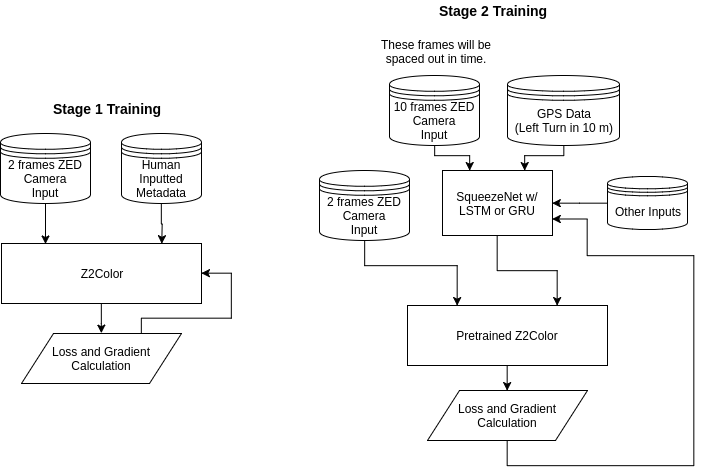

# SqueezeNet Meeting Topics and Ideas

## Metadata Inference

#### Stage 1 Training (Training the Driving/SafetyNet Network)

The Z2Color network will be trained to execute the commands (metadata) and to do things like avoid crashing and continue forward in a lane. This way if we see dangerous behavior from our network we can isolate the problem to this network and can take appropriate action.

#### Stage 2 Training (Training the Decision Making Network)

The SqueezeNet network will be trained to take in input data through a larger time interval as well as from a multitude of inputs (like GPS). This allows it to make decisions about where to go and what to do, which it can send to the driving network through the metadata pipeline. Not only this, it can mix and match certain metadata modes in different ratios to get different results out of the network. (Can send lane change + right to do a right lane change etc.)

SqueezeNet is great at image classification. The metadata selection process should be similar to this task that SqueezeNet has proven to be good at. It will have jobs like identify stop signs and stop lights and understanding these as a stop signal and sending the appropriate metadata command to the driving network.

One of the things to include in SqueezeNet would be temporal expansion. By giving the network more frames and more memory it can make educated decisions based on te past when sendig commands to the driving network.  Although this may increase the lag between recieving a frame and processing it, it's ok. **We can run the drive net multiple times with the metadata from a past output of SqueezeNet while SqueezeNet is running, and in the meantime the drive network should be capable of driving for short periods of time without crashing or screwing up the directions. (The netwoks will be run on seperate threads)**

Although this is not end to end learning, it allows for visibility into the networks to see what they are doing and why [(a big problem) w/ end to end learning for self driving cars](https://www.technologyreview.com/s/604087/the-dark-secret-at-the-heart-of-ai/?set=604130). People need to know what to blame if something goes wrong. A metadata pipeline, with different jobs delegated to different networks is great for this.

## Replacing Z2Color w/ SqueezeNet

AlexNet has been proven to be good at the regression task, since SqueezeNet can match AlexNet's performance in classification it might have the same characteristics and we could replace SqueezeNet with Z2Color as our driving network. This has already been implemented and we've been getting [fairly good results](https://github.com/sauhaardac/Notes/blob/master/daily-logs/5-14-17.md#replacing-z2color-with-squeezenet-as-the-drive-network).
